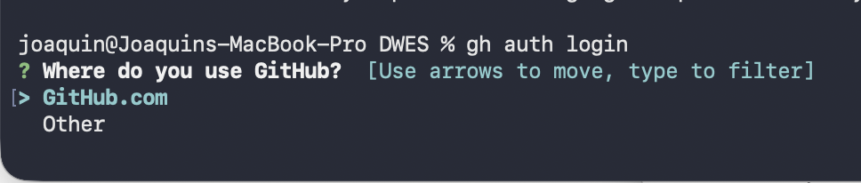
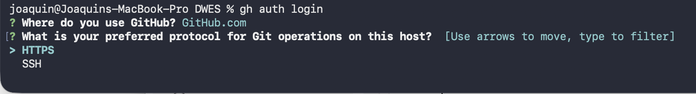
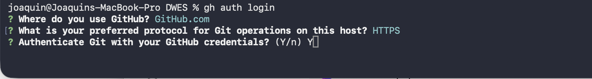
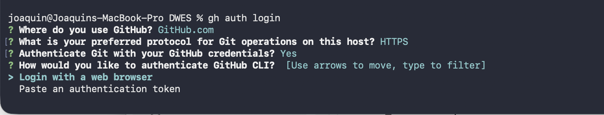
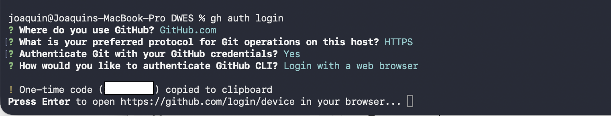
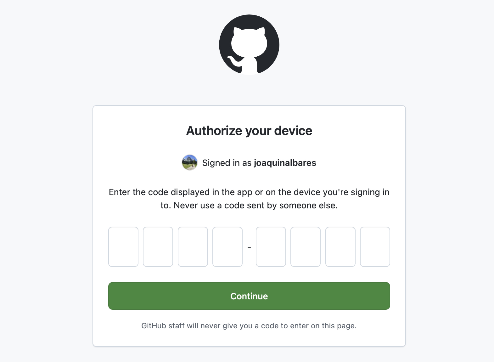
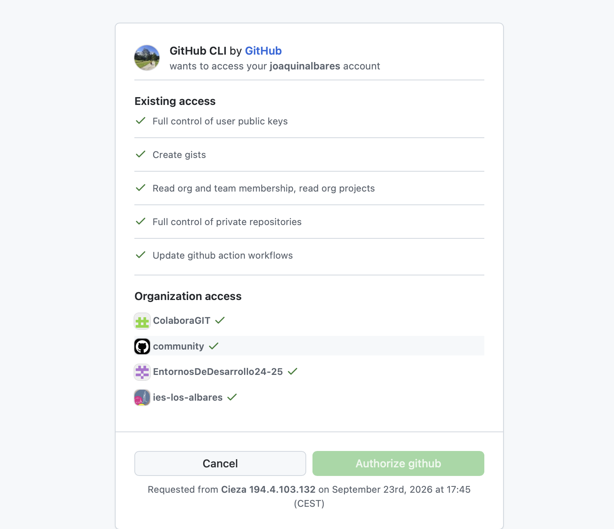
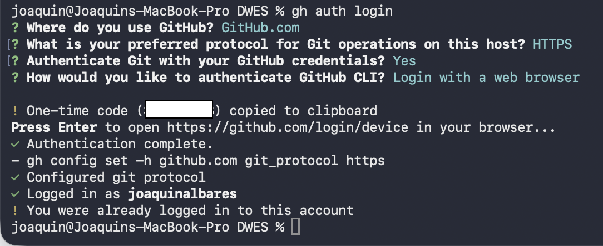
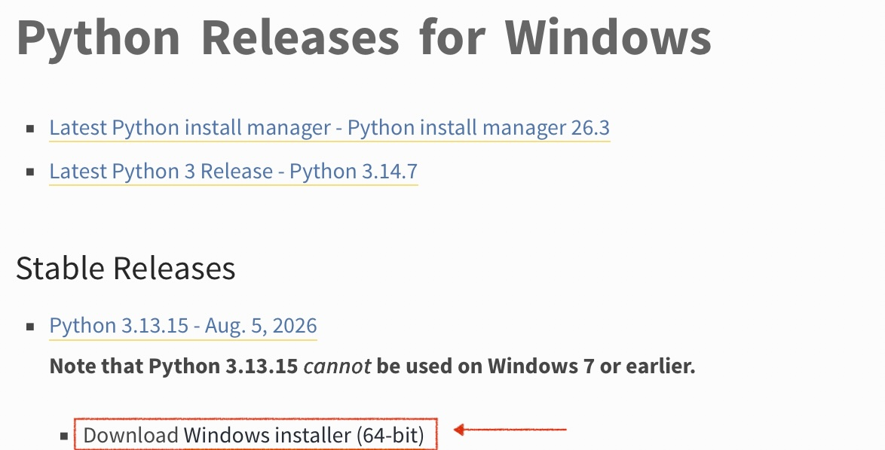

# PRÁCTICA GUIADA 01: DESPLIEGUE DE DOCUMENTACIÓN TÉCNICA CON PROPERDOCS Y TEMA "READTHEDOCS"

---

## 1. CONFIGURACIÓN DE GIT Y GITHUB.

/// admonition | **REQUISITOS PREVIOS**

Esta práctica asume que se ha instalado y configurado [GIT](https://git-scm.com) en el equipo del alumno y que se está usando una máquina Windows.
///

### Paso 1: Crear el repositorio en GitHub.

Se debe crear con el nombre de ```proyecto2627``` y hacerlo público. El archivo ```README.md``` debe incluir infiormación básica del proyecto y la asignatura.

### Paso 2: instalar el cliente de GitHub para la terminal.

Entra en la página [cli.github.com](https://cli.github.com) y sigue los pasos para instalar el cliente de terminal en el equipo.

### Paso 3: configura ```gh``` con tus credenciales de GitHub.

Ejecuta el comando ```gh auth login`` y sigue los pasos siguientes:

 

Elegimos la primera opción, pues vamos a usar GitHub.



Elegimos HTTPS para autorizar a ```gh```a través de la web.



Escribimos ```Y``` y pulsamos ```Enter```para usar nuestra credenciales.



Elegimos la primera opción para identificarnos a través del navegador.



Nos fijamos que haya generado el código (NO HACE FALTA COPIARLO, PUES SE HACE AUTOMÁTICAMENTE) y pulsamos ```Enter```. Se nos abrirá el navegador para que nos identifiquemos en GitHub si no lo habíamos hecho antes. 



Nos identificamos y pegamos el código del paso anterior.



Pulsamos en ```Authorize github```



Si todo ha ido bien, el proceso finaliza aquí.

## 2. INSTALACIÓN DE PYTHON

/// admonition | **PYTHON y ENTORNOS ```venv```**
    type: warning

Aunque lo recomendable es virtualizar cada proyecto de python mediante ```venv```r, por simplicidad vamos a configura todo de manera global.
///

Esta es una guía paso a paso para descargar e instalar **Python** en sistemas operativos **Windows**.

---

### **Paso 1: Descargar el instalador oficial**

1. Abre tu navegador web y entra en el sitio oficial de Python: [python.org](https://www.python.org/downloads/windows/).
2. Elegimos la última versión estable.



---

### **Paso 2: Ejecutar el instalador**

1. Ve a la carpeta de **Descargas** de tu ordenador y haz doble clic sobre el archivo ejecutable `.exe` descargado (ejemplo: `python-3.12.x-amd64.exe`).
2. Aparecerá la ventana inicial del instalador.

---

### **Paso 3: Marcar la opción del PATH (¡Paso crítico!)**

Antes de hacer clic en cualquier botón de la ventana del instalador, debes **marcar la casilla inferior** que dice **"Add python.exe to PATH"** (o *"Add Python to environment variables"*).

> **¿Por qué es importante?**
> Marcar esta casilla te permitirá ejecutar Python y sus herramientas (como `pip`) desde cualquier ventana de comandos (Terminal o CMD) sin tener que configurar variables de entorno manualmente.

```text
  ┌──────────────────────────────────────────────────────────────┐
  │ Python 3.12.x (64-bit) Setup                                 │
  │                                                              │
  │ Select Install Now or Customize Install...                   │
  │                                                              │
  │   [ Install Now ]                                            │
  │   C:\Users\Usuario\AppData\Local\Programs\Python\...         │
  │                                                              │
  │   [ Customize installation ]                                 │
  │                                                              │
  │ ☒ Use admin privileges when installing py.exe                │
  │ ☒ Add python.exe to PATH   ◄─────────────────── ¡MARCAR AQUÍ!│
  └──────────────────────────────────────────────────────────────┘

```

---

### **Paso 4: Iniciar la instalación**

1. Una vez marcada la casilla del PATH, haz clic en **"Install Now"**.
2. Si Windows te pide confirmación mediante la ventana de *Control de cuentas de usuario* ("¿Deseas permitir que esta aplicación haga cambios en el dispositivo?"), haz clic en **Sí**.
3. Espera a que se complete la barra de progreso (*Setup Progress*).

```text
  ┌──────────────────────────────────────────────────────────────┐
  │ Python 3.12.x (64-bit) Setup                                 │
  │                                                              │
  │ Setup Progress                                               │
  │ Installing:                                                  │
  │ [████████████████████████░░░░░░░░]                           │
  └──────────────────────────────────────────────────────────────┘

```

---

### **Paso 5: Finalizar la instalación**

1. Cuando la instalación concluya con éxito, verás el mensaje **"Setup was successful"**.
2. Si ves una opción al final que dice **"Disable path length limit"**, se recomienda hacer clic en ella (elimina la restricción de Windows de 260 caracteres para rutas de archivos largos).
3. Haz clic en el botón **Close**.

```text
  ┌──────────────────────────────────────────────────────────────┐
  │ Python 3.12.x (64-bit) Setup                                 │
  │                                                              │
  │ Setup was successful                                         │
  │ New to Python? Start with the online tutorial...             │
  │                                                              │
  │                                              ┌───────────┐   │
  │                                              │   Close   │   │
  │                                              └───────────┘   │
  └──────────────────────────────────────────────────────────────┘

```

---

### **Paso 6: Comprobar que Python se ha instalado correctamente**

1. Presiona las teclas `Windows + R` en tu teclado, escribe `cmd` y presiona **Enter** para abrir el **Símbolo del sistema**.
2. Escribe el siguiente comando y pulsa **Enter**:

```bash
python --version

```

3. Si la instalación ha sido correcta, el sistema responderá mostrando la versión instalada (ejemplo: `Python 3.12.2`).

```text
  ┌──────────────────────────────────────────────────────────────┐
  │ C:\Users\Usuario> python --version                           │
  │ Python 3.12.2                                                │
  │                                                              │
  │ C:\Users\Usuario> pip --version                              │
  │ pip 24.0 from C:\...\python312\Lib\site-packages...          │
  └──────────────────────────────────────────────────────────────┘

```

### Paso 7: ¿Y SI NO FUNCIONA PIP?

Si tras instalar Python ejecutas `pip` en la terminal o símbolo del sistema (CMD) y obtienes un mensaje de error como **«'pip' no se reconoce como un comando interno o externo»** o **«command not found»**, significa que el sistema operativo no sabe dónde encontrar el ejecutable de `pip`.

Esto sucede principalmente porque el ejecutable de Python/pip no está en el PATH.

#### Solución: Añadir Python al PATH automáticamente

1. Vuelve a ejecutar el instalador `.exe` de Python que descargaste.
2. Selecciona la opción **"Modify"** (Modificar).
3. Avanza en las pantallas asegurándote de que la opción **"pip"** esté marcada en *Optional Features*.
4. En la pantalla de *Advanced Options*, marca la casilla **"Add Python to environment variables"**.
5. Haz clic en **Install** y, al finalizar, **reinicia la ventana de la terminal/CMD**.

/// admonition | **SOLUCIÓN ALTERNATIVA**
    type: warning
 Descarga el script [https://bootstrap.pypa.io/get-pip.py](https://bootstrap.pypa.io/get-pip.py) y ejecútalo

```bash
python get-pip.py

```
///

---

## 3. INSTALACIÓN DE PROPERDOCS

### Paso 2: Instalación de paquetes con `pip`

Con el entorno virtual activado, instala el paquete principal de MkDocs y el paquete del tema Read the Docs:

```bash
# Actualizar pip
pip install --upgrade pip

# Instalar MkDocs y el tema readthedocs
pip install properdocs mkdocs-readthedocs-theme

```

Para verificar que la instalación se ha realizado correctamente, ejecuta:

```bash
mkdocs --version

```

---

## 4. INICIALIZACIÓN Y CONFIGURACIÓN DEL PROYECTO

### Paso 3: Generar la estructura base

Inicializa un nuevo proyecto de MkDocs dentro de la carpeta actual:

```bash
mkdocs new .

```

Este comando habrá creado la siguiente estructura en tu directorio:

```text
documentacion-dwes/
├── docs/
│   └── index.md          # Página principal de la documentación
├── mkdocs.yml            # Archivo de configuración global
└── venv/                 # Entorno virtual de Python

```

### Paso 4: Configurar el archivo `mkdocs.yml`

Abre el archivo `mkdocs.yml` con tu editor preferido (VS Code, Nano, Vim) y sustituye su contenido por la siguiente configuración completa que activa el tema **`readthedocs`** y organiza la navegación del sitio:

```yaml
site_name: "Documentación Técnica DWES"
site_description: "Guía de estándares, arquitectura web y servidor para DAW"
site_author: "Alumno DAW - IES Los Albares"

# Selección del tema Read the Docs
theme:
  name: readthedocs
  highlightjs: true
  hljs_languages:
    - php
    - bash
    - json
    - html

# Estructura de navegación lateral
nav:
  - Inicio: index.php.md
  - Estándares y Nombrado:
      - Reglas de Directorios: estandares/nombrado.md
  - Servidor Web:
      - Protocolo HTTP: servidor/respuestas-http.md

# Opciones adicionales
markdown_extensions:
  - tables
  - codehilite

```

---

## 5. CREACIÓN DE CONTENIDOS EN MARKDOWN

### Paso 5: Generar los archivos de documentación

Crea las carpetas y los archivos especificados en la sección `nav` de tu archivo de configuración:

```bash
mkdir -p docs/estandares docs/servidor

```

#### A. Crear `docs/index.md`:

```markdown
# Documentación del Módulo DWES

Bienvenido a la documentación oficial del módulo **Desarrollo Web en Entorno Servidor**.

## Contenidos Principales
* Estándares de nombrado de archivos y directorios.
* Configuración de servidores web en Linux (Apache/Nginx/Lerd).
* Estructura y códigos de respuesta del protocolo HTTP.

```

#### B. Crear `docs/estandares/nombrado.md`:

```markdown
# Estándares de Nombrado de Archivos

En entornos de servidor Linux, el sistema de archivos es sensible a mayúsculas y minúsculas (*Case Sensitive*).

## Reglas de Oro
1. **kebab-case:** Usar minúsculas y guiones medios para archivos web (`mi-pagina.php`).
2. **Sin caracteres especiales:** Evitar espacios, tildes, eñes y símbolos (`$`, `%`, `@`).
3. **Imágenes y Assets:** Guardar imágenes en formato PNG/SVG con nombres claros (`assets/img/logo-oficial.png`).

```

#### C. Crear `docs/servidor/respuestas-http.md`:

```markdown
# Respuestas y Códigos HTTP

El protocolo HTTP utiliza códigos numéricos para indicar el estado de la petición.

| Código | Significado | Descripción |
| :--- | :--- | :--- |
| **200** | OK | Petición procesada correctamente. |
| **301** | Moved Permanently | Redirección permanente a una nueva URL. |
| **404** | Not Found | El recurso o archivo no existe en el servidor. |
| **500** | Internal Error | Excepción no capturada en el servidor (PHP/Python). |

```

---

## 6. PREVISUALIZACIÓN Y COMPILACIÓN

### Paso 6: Servir la documentación en tiempo real

Inicia el servidor interno de pruebas de MkDocs:

```bash
mkdocs serve

```

Abre tu navegador e introduce la dirección local indicada por la terminal (por defecto, `[http://127.0.0.1:8000/](http://127.0.0.1:8000/)`). Verás la interfaz temática de **Read the Docs** cargada con tu contenido. Cualquier cambio que guardes en los archivos `.md` se actualizará automáticamente en la pantalla.

### Paso 7: Compilar el sitio para producción (`site/`)

Para generar el sitio estático final compuesto únicamente por HTML, CSS, JavaScript e imágenes listas para subir a cualquier servidor web (como Apache o Nginx):

```bash
mkdocs build

```

Este comando creará la carpeta `site/`. Su contenido es el entregable final de producción de tu documentación.

---

## 7. ACTIVIDAD / TRABAJO PARA EL ALUMNADO (`[LIBRETA]`)

1. **[LIBRETA]** Copia en tu cuaderno el árbol final de directorios del proyecto generado tras ejecutar `mkdocs build`, indicando qué función cumple la carpeta `site/` frente a la carpeta `docs/`.
2. **[LIBRETA]** Explica qué ocurriría si intentas ejecutar el comando `mkdocs serve` en una terminal nueva sin haber activado previamente el entorno virtual (`source venv/bin/activate`).
3. **[PRÁCTICA EN EQUIPO]** Personaliza el archivo `mkdocs.yml` añadiendo una nueva sección en el menú lateral titulada `"Entorno Lerd"` que contenga una guía rápida con los comandos básicos de terminal para desplegar un contenedor web.
