# PRÁCTICA GUIADA 01: DESPLIEGUE DE DOCUMENTACIÓN TÉCNICA CON PROPERDOCS Y TEMA "READTHEDOCS"

---

/// admonition | **Terminal de Windows**
    type: hint

Para abrir el **Símbolo del sistema** (terminal o intérprete de comandos), pulsa las teclas `Windows + R`, escribe `cmd` en el recuadro que aparece y pulsa ```Enter```.
///


## 1. INSTALACIÓN Y CONFIGURACIÓN DE GIT.

### Paso 1: Descargar el instalador oficial
Nos descargamos la última versión de ```GIT``` desde la web oficial **[GIT](https://git-scm.com)**.

### Paso 2: Ejecutar el instalador
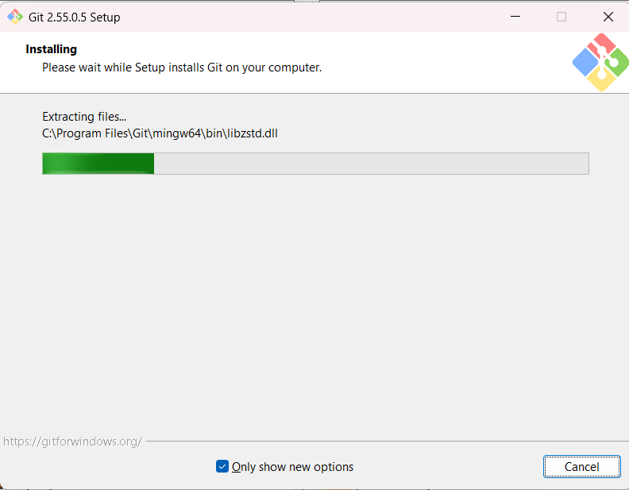 

### Paso 3: Configuramos GIT

Es necesario da un nombre de usuario y un correo electrónico para identificar quien trabja en el repositorio. Para ello, abrimos el ```CMD``` y escribimos las dos instrucciones siguientes:
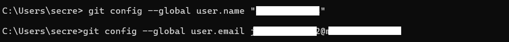 

### Paso 4: Verficamos la instalación
Es necesario da un nombre de usuario y un correo electrónico para identificar quien trabja en el repositorio.
 

 

## 2. CONFIGURACIÓN DEL CLIENTE DE TERMINAL DE GITHUB.

### Paso 1: Crear el repositorio en GitHub.
Se debe crear con el nombre de ```proyecto2627``` y hacerlo público. El archivo ```README.md``` debe incluir infiormación básica del proyecto y la asignatura.

### Paso 2: instalar el cliente de GitHub para la terminal.

Entra en la página [cli.github.com](https://cli.github.com) y sigue los pasos para instalar el cliente de terminal en el equipo, dependiendo del sistema operativo. En nuestro caso podemos optar por el archivo ```MSI``` si no queremos usar winget.

### Paso 3: configura ```gh``` con tus credenciales de GitHub.

Ejecuta el comando ```gh auth login`` y sigue los pasos siguientes:

1. Pulsamos ```Enter``` para elegir la primera opción, pues vamos a usar GitHub.
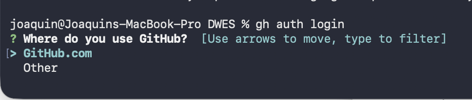 

2. Pulsamos ```Enter``` para autorizar a ```gh```a través de la web.
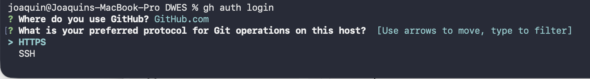

4. Escribimos ```Y``` y pulsamos ```Enter```para usar nuestra credenciales.
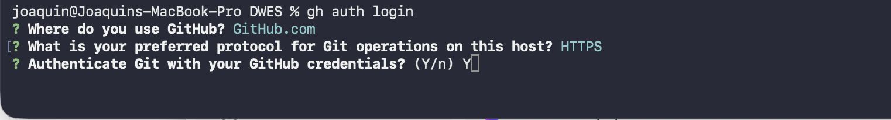

5. Pulsamos ```Enter``` para elegir la primera opción e identificarnos a través del navegador.

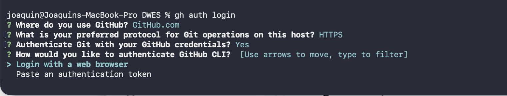

6. Nos fijamos que haya generado el código (NO HACE FALTA COPIARLO, PUES SE HACE AUTOMÁTICAMENTE) y pulsamos ```Enter```. Se nos abrirá el navegador para que nos identifiquemos en GitHub si no lo habíamos hecho antes.  

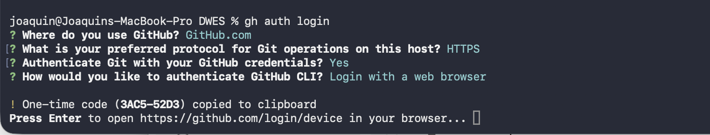

7. Nos identificamos y pegamos el código del paso anterior.

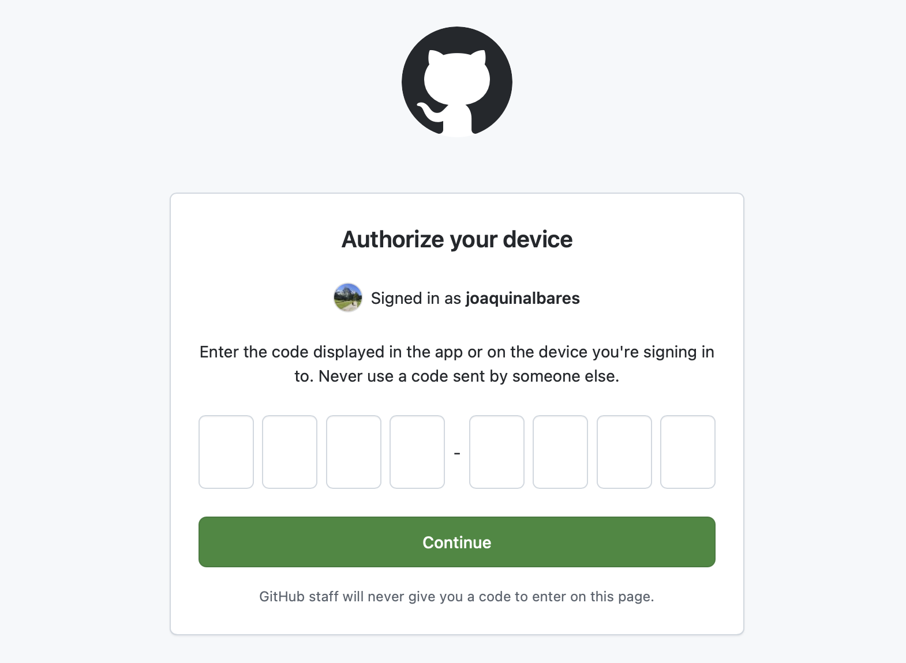

8. Hacemos clic en ```Authorize github```

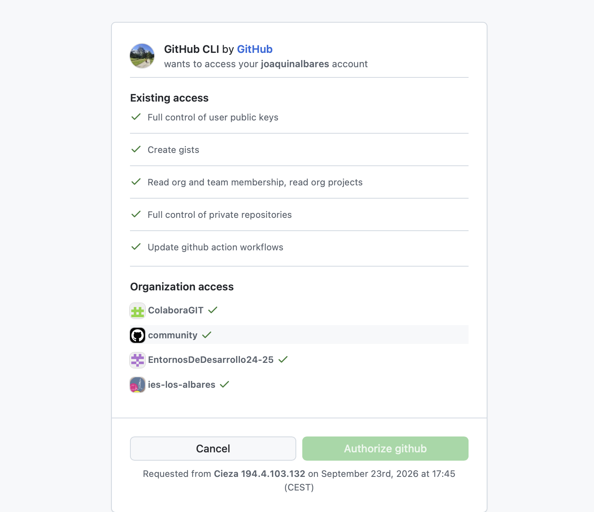

9. Si todo ha ido bien, el proceso finaliza y vemos de nuevo el prompt de la terminal.

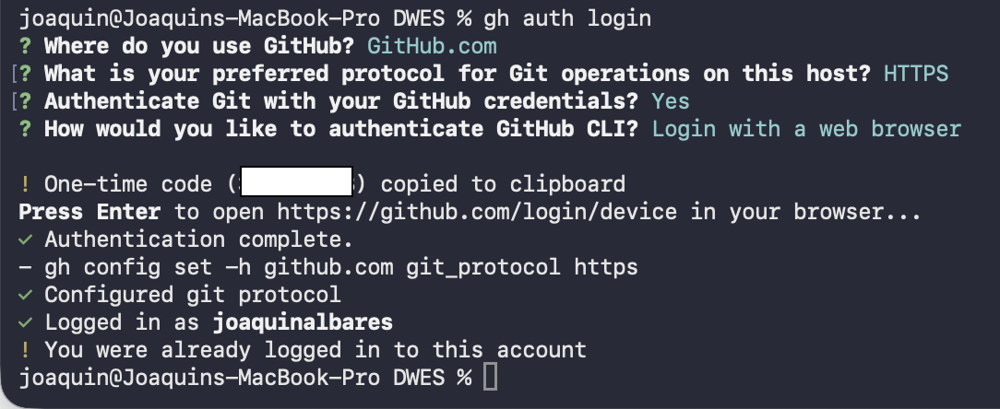


## 2. INSTALACIÓN DE PYTHON

/// admonition | **PYTHON y ENTORNOS ```venv```**
    type: warning

Aunque lo recomendable es virtualizar cada proyecto de python mediante ```venv```r, por simplicidad vamos a configura todo de manera global.
///

Esta es una guía paso a paso para descargar e instalar **Python** en sistemas operativos **Windows**.

---

### Paso 1: Descargar el instalador oficial

1. Abre tu navegador web y entra en el sitio oficial de Python: [python.org](https://www.python.org/downloads/windows/).
2. Elegimos la última versión estable.

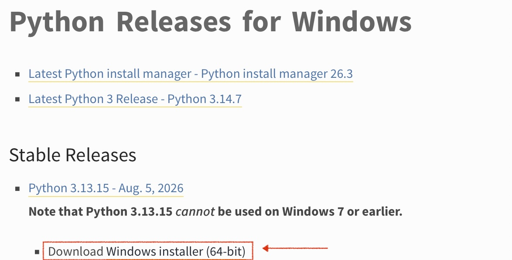

---

### Paso 2: Ejecutar el instalador

1. Ve a la carpeta de **Descargas** de tu ordenador y haz doble clic sobre el archivo ejecutable `.exe` descargado (ejemplo: `python-3.12.x-amd64.exe`).
2. Aparecerá la ventana inicial del instalador.

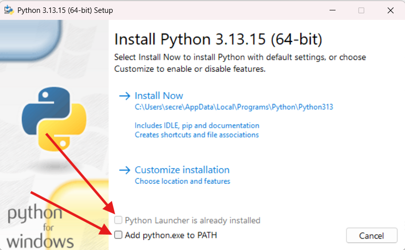

---

### Paso 3: Marcar la opción del PATH (¡fundamental!)

Antes de hacer clic en cualquier botón de la ventana del instalador, debes **marcar la casilla inferior** que dice **"Add python.exe to PATH"** (o *"Add Python to environment variables"*).

/// admonition | **¿Por qué es importante?**
    type: caution

Al marcar esta casilla podremos ejecutar Python y sus herramientas (como `pip` , que es la que vamos a necesitar) desde cualquier ventana de comandos (Terminal o CMD) sin tener que configurar variables de entorno manualmente.
///

---

### Paso 4: Iniciar la instalación

1. Una vez marcada la casilla del PATH, haz clic en **"Install Now"**.
2. Si Windows te pide confirmación mediante la ventana de *Control de cuentas de usuario* ("¿Deseas permitir que esta aplicación haga cambios en el dispositivo?"), haz clic en **Sí**.
3. Espera a que se complete la barra de progreso (*Setup Progress*).

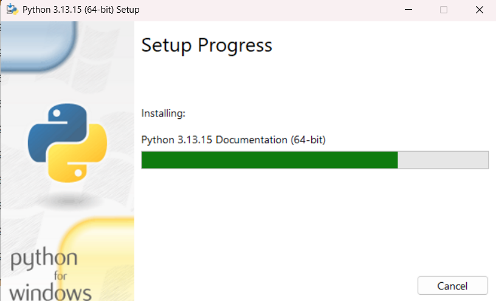

---

### Paso 5: Finalizar la instalación

1. Cuando la instalación concluya con éxito, verás el mensaje **"Setup was successful"**.
2. Si ves una opción al final que dice **"Disable path length limit"**, se recomienda hacer clic en ella (elimina la restricción de Windows de 260 caracteres para rutas de archivos largos).
3. Haz clic en el botón **Close**.

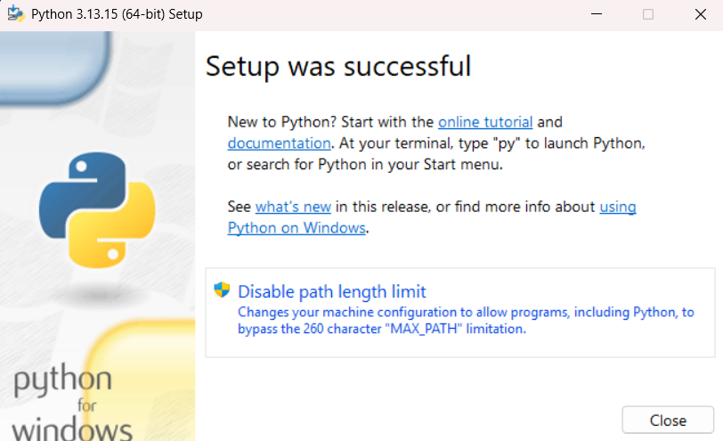

---

### Paso 6: Comprobar que Python se ha instalado correctamente

1. Abrimos una ventana de terminal.
2. Escribe el siguiente comando y pulsa **Enter**:

```bash
python --version

```

3. Si la instalación ha sido correcta, el sistema responderá mostrando la versión instalada (ejemplo: `Python 3.12.2`).

```text
  ┌──────────────────────────────────────────────────────────────┐
  │ C:\Users\Usuario> python --version                           │
  │ Python 3.12.2                                                │
  │                                                              │
  │ C:\Users\Usuario> pip --version                              │
  │ pip 24.0 from C:\...\python312\Lib\site-packages...          │
  └──────────────────────────────────────────────────────────────┘

```

### Paso 7: ¿Y SI NO FUNCIONA PIP?

Si tras instalar Python ejecutas `pip` en la terminal o símbolo del sistema (CMD) y obtienes un mensaje de error como **«'pip' no se reconoce como un comando interno o externo»** o **«command not found»**, significa que el sistema operativo no sabe dónde encontrar el ejecutable de `pip`.

Esto sucede principalmente porque el ejecutable de Python/pip no está en el PATH.

#### Solución: Añadir Python al PATH automáticamente

1. Vuelve a ejecutar el instalador `.exe` de Python que descargaste.
2. Selecciona la opción **"Modify"** (Modificar).
3. Avanza en las pantallas asegurándote de que la opción **"pip"** esté marcada en *Optional Features*.
4. En la pantalla de *Advanced Options*, marca la casilla **"Add Python to environment variables"**.
5. Haz clic en **Install** y, al finalizar, **reinicia la ventana de la terminal/CMD**.

/// admonition | **SOLUCIÓN ALTERNATIVA**
    type: warning
 Descarga el script [https://bootstrap.pypa.io/get-pip.py](https://bootstrap.pypa.io/get-pip.py) y ejecútalo

```bash
python get-pip.py

```
///

---

## 3. INSTALACIÓN DE PROPERDOCS

Para elaborar la documentación de nuestro proyecto,vamos a instalar la herramienta **[properdocs](https://properdocs.org/)**.

/// admonition | **ENTORNO DE INSTALACIÓN**
    type: note

  En nuestro caso, y dado que no vamos a desarrollar en python, todas las librerías las instalaremos globalmente sin activar entornos virtuales de python.
///

Antes de instalar las librerías vamos a actualizar pip:
```bash
pip install --upgrade pip
```

Una vez actualizado, ya podemos instalar properdocs y dos temas adicionales: mkdocs y material:
```bash
pip install properdocs properdocs-theme-mkdocs mkdocs-material
```

Para verificar que la instalación se ha realizado correctamente, ejecuta:

```bash
properdocs --version

```

---

## 4. INICIALIZACIÓN Y CONFIGURACIÓN DEL PROYECTO

### Paso 1: Clonar el repositorio remoto

En primer lugar, y para asegurarnos que trabajamos con el repositorio de GitHub y que nuestros cambios se van a sincronizar correctamente, vamos a descargarnos nuestro repositorio. Para ello, en GitHub, pulsando  el botoón verde ```code``` y eligiendo la pestaña ```GitHub CLI```, vemos el comando que tenemos que escribir par clonar nuestro repositorio.

```bash
gh repo clone joaquinalbares/proyecto2627
```

/// admonition 
    type: important

  - Cada uno clonará su repo, no el del profesor.
  - Se recomienda crear una parpeta GitHub dentro de la carpeta de usuario para tener todos los repositorios en el mismo sitio.
///


Ahora accedemos al repositorio en inicializamos un nuevo proyecto de ProperDocs dentro de la carpeta actual:

```bash
cd proyecto2627
properdocs new .
```

Este comando habrá creado la siguiente estructura en tu directorio:

```text
docs/
  └── index.md        # Página principal de la documentación
properdocs.yml        # Archivo de configuración global
```

### Paso 2: Configurar el archivo `properdocs.yml`

Abre la carpeta del proyecto con tu editor preferido (recomiendo **[Zed]()https://zed.dev/)** y sustituye el contenido del archivo `properdocs.yml` por la siguiente configuración completa que activa el tema **`readthedocs`** y organiza la navegación del sitio:

```yaml
site_name: "Proyecto Intermodular"
site_description: "Proyecto Intermodular del Ciclo Formativo de Desarrollo de aplicaciones Web"
site_author: "Alumno DAW - IES Los Albares"

# Selección del tema Read the Docs
theme:
  name: readthedocs
  highlightjs: true
  hljs_languages:
    - php
    - bash
    - json
    - html

# Estructura de navegación lateral
nav:
  - Inicio: index.md

# Opciones adicionales
markdown_extensions:
  - tables
  - codehilite

```

---

## 6. PREVISUALIZACIÓN Y COMPILACIÓN

Inicia el servidor interno de pruebas de MkDocs:

```bash
properdocs serve
```

Abre tu navegador e introduce la dirección local indicada por la terminal (por defecto, [http://127.0.0.1:8000/](http://127.0.0.1:8000/)). Verás el sitio que ha generado con la interfaz temática de **Read the Docs** cargada con tu contenido. Cualquier cambio que guardes en los archivos `.md` a partir de ahora y mientras estés sirvinedo el sitio, se actualizará automáticamente en la pantalla.

Podemos detener el servicio pulsando `Ctrl+C`.

---

## 7. PUBLICACIÓN EN GITHUB PAGES

Cuando queramos publicar nuestro sitio para que sea visible, podemos usar el comando que proporciona properdocs, y que funcionará correctamente sin hacer ninguna configuración más si hemos seguido todos los pasos de esta práctica.

Para ello escribimos:

```bash
properdocs gh-deploy
```

Y se iniciará el proceso de creación de ramas, configuración y publicación del sitio manera automática. Emitiendo unos mensajes parecidos a los siguientes:

```bash
INFO    -  Cleaning site directory
INFO    -  Building documentation to directory: /Users/joaquin/GitHub/proyecto2627/site
INFO    -  Documentation built in 0.11 seconds
INFO    -  Copying '/Users/joaquin/GitHub/proyecto2627/site' to 'gh-pages' branch and pushing to GitHub.
Enumerating objects: 17, done.
Counting objects: 100% (17/17), done.
Delta compression using up to 8 threads
Compressing objects: 100% (8/8), done.
Writing objects: 100% (9/9), 3.50 KiB | 3.50 MiB/s, done.
Total 9 (delta 7), reused 0 (delta 0), pack-reused 0 (from 0)
remote: Resolving deltas: 100% (7/7), completed with 7 local objects.
To https://github.com/joaquinalbares/proyecto2627.git
   62746d3..5e31d06  gh-pages -> gh-pages
INFO    -  Your documentation should shortly be available at: https://joaquinalbares.github.io/proyecto2627/
```

Si esperamos unos minutos, ya podremos ver nuestra página publicada en Internet: 

**[https://joaquinalbares.github.io/proyecto2627/](https://joaquinalbares.github.io/proyecto2627/)**
